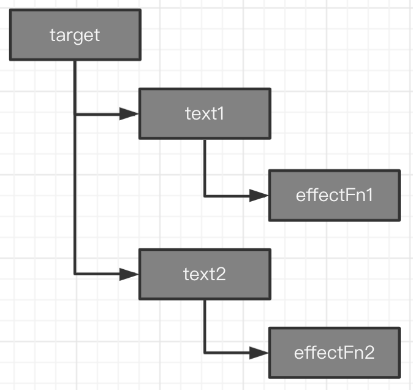

# 响应式

### 基本实现

##### effect函数
effect函数在vue3中主要负责收集依赖，更新依赖。基本实现中effect函数非常简单。
```javascript
function effect() {
	document.body.innerText = 'hello vue3';
}
```
##### Proxy
想要实现响应式，就要拦截对象的读取与设置操作。vue3使用Proxy代替了vue2中的Object.defineProperty()。

如何使下面的json变成响应式，当text改变时effect函数重新执行？
```javascript
const json = { text: 'hello world' };

function effect() {
	document.body.innerText = json.text;
}

setTimeout(() => {
	json.text = 'hello world';
})
```

实现方式:
```javascript
const json = { text: 'hello world' };

function effect() {
    document.body.innerText = json.text;
}

// 代理操作对象
const obj = new Proxy(json, {
    // 拦截读取操作
    get: (target, key) => {
        // 返回值
        return target[key]
    },
    // 拦截设置操作
    set: (target, key, value) => {
        target[key] = value
        // 当监听到设置操作时重新执行effect函数
        effect()
        return true
    }
})

effect()

obj.text = 'hello vue3!';
```

### 完善响应式

当前问题:
1. 硬编码了effect函数
2. 修改任意对象属性,effect函数都会调用.
3. effect函数中没有处理分支切换
4. effect嵌套effect
5. 无限递归循环的情况

#### 1.硬编码effect函数,不支持匿名函数
基本实现中effect函数直接写在了拦截操作中,如果收集依赖的函数不叫effect,就无法正常工作了。
要保证依赖收集函数能够正确运行,则需要提供一个注册机制。

解决方法:
1. 生名一个全局变量activeEffect
2. effect函数参数接收一个匿名函数,将匿名函数赋值给activeEffect，同时调用一次匿名函数
3. 拦截设置操作由直接调用effect函数变为调用activeEffect

> 具体实现: src/effect-hard-code.html
```javascript
let activeEffect;

function effect(fn) {
    activeEffect = fn;
    fn()
}

// 代理操作对象
const obj = new Proxy(json, {
    ...
    // 拦截设置操作
    set: (target, key, value) => {
        target[key] = value
        // 当监听到设置操作时重新执行effect函数
        activeEffect()
        return true
    }
})
```

#### 2.修改任意对象属性,effect函数都会调用

当前实现中修改任意json的属性都会触发effect函数。
```javascript
obj.newKey = 'new'
```
这里的newKey是新增加的属性,而effect函数中并没有使用到该属性,所以并不应该在设置属性的时候，调用effect函数。  

之所以effect函数被调用了，这是因为effect函数并没有与修改的属性建立对应的依赖关系。

解决方法:  
1.创建存储依赖关系的WeakMap  
2.修改Proxy中的get方法，进行依赖收集  
3.修改Proxy中的set方法，执行收集到的依赖。

##### - 存储依赖关系的WeakMap
观察effect函数可以看到函数内存在三个角色，代理对象(target) obj、字段名(key) text和effect函数传进去的函数(effectFn)。
```javascript
effect(() => {
    obj.text
})
```
所以可以建立如下的关系:


WeakMap中存贮的就是这样的结构。结构图如下:  
> 结构图等待后补

> 具体实现: src/deps.html
```javascript
const bucket = new WeakMap()

// 代理操作对象
const obj = new Proxy(json, {
    // 拦截读取操作
    get: (target, key) => {
        if (!activeEffect) return
        let depsMap = bucket.get(target)

        if (!depsMap) {
            // 不存在时新建Map并关联target
            bucket.set(target, depsMap = new Map())
        }

        let deps = depsMap.get(key)
        if (!deps) {
            // deps不存在时新建Set
            depsMap.set(key, deps = new Set())
        }
        // 将activeEffect函数与key关联
        deps.add(activeEffect)
        // 返回值
        return target[key]
    },
    // 拦截设置操作
    set: (target, key, value) => {
        target[key] = value

        let depsMap = bucket.get(target)
        if (!depsMap) return

        let effects = depsMap.get(key)
        effects && effects.forEach(fn => fn())

        return true
    }
})
```

#### 3.effect函数中处理分支切换
什么是分支切换?
简单来说，effect函数中有三元表达式。

请阅读下面的代码:
```javascript
const data = {ok: true, text: 'hello world'}

const obj = new Proxy(data, {...})

effect(function effectFn() {
    obj.ok ? obj.text : 'not'
})
```
初始状态下obj.ok 为 true,effect函数执行时，收集依赖会同时收集到两个依赖:1、obj.ok的依赖2、obj.text的依赖。  

依赖图如下:
> 后补

当执行下面代码后
```javascript
obj.ok = false
```
会触发依赖更新和依赖effectFn执行。但是这个时候obj.text的effectFn函数还存在于依赖WeakMap中。
但现在obj.ok为false, 无论obj.text怎么变化，三元表达式执行后永远都返回'not'，因此obj.text的effectFn可以从依赖中清除。

解决方法:  
1.在effect内部定义新的effectFn  
2.effectFn添加属性deps, deps数组类型，用来存贮所有包含当前effect函数依赖。  
3.track函数中将所有depsMap.get(key)获取到的依赖添加到effectFn的deps中去

> 具体实现: src/branch-switch.html

```javascript
function effect(fn) {
    const effectFn = () => {
        cleanup(effectFn)
        activeEffect = effectFn
        fn()
    }
    // 存贮所有与当前effect函数相关联的依赖集合
    effectFn.deps = []

    effectFn()
}

function track(target, key) {
    ...
    // deps是一个与当前effect函数相关联的集合
    // 将其添加到activeEffect.deps中去
    activeEffect.deps.push(deps)
}
```

#### 4.支持effect嵌套effect
为什么需要支持effect嵌套effect?
vue中的渲染函数就是在effect函数中执行的。
```javascript
const Foo = {
    render() {
        return /* .... */
    }
}

effect(() => {
    Foo.render()
})
```

假设有两个组件:
```javascript
const Eraser = {
    render() { /* ... */}
}

const Drawer = {
    render () {
        return <Eraser />
    }
}
```
就相当于是：
```javascript
effect(() => {
    Drawer.render()
    
    effect(() => {
        Eraser.render()
    })
})
```

解决方法:  
1.创建一个effect函数的栈effectStack  
2.effect函数执行前将effectFn压入effectStack
3.effect函数执行后，将其弹出，并将activeEffect指向effectStack栈顶的函数

> 具体实现: src/effect-nest.html

```javascript
// 新增
const effectStack = []

function effect(fn) {
    const effectFn = () => {
        cleanup(effectFn)
        activeEffect = effectFn
        // 新增
        effectStack.push(effectFn)

        fn()
        // 新增
        effectStack.pop()
        activeEffect = effectStack[effectStack.length - 1]
    }
    // 存贮所有与当前effect函数相关联的依赖集合
    effectFn.deps = []

    effectFn()
}
```

#### 5.递归循环的情况
为什么会出现递归循环的情况？

effect函数中出现了既读取又赋值的操作。
```javascript
const data = { foo: 0 }
const obj= new Proxy(data, { /* ... */})

effect(() => {
    obj.foo = obj.foo + 1
})
```
读取obj.foo的时候会触发track函数，赋值obj.foo时又触发了trigger函数，trigger函数中又执行了effect函数,形成递归调用。

> 具体实现: src/effect-recursion.html

```javascript
function trigger(target, key) {
    ...
    
    const effectsToRun = new Set()
    effects && effects.forEach((effectFn) => {
        if (effectFn !== activeEffect) {
            effectsToRun.add(effectFn)
        }
    })
    
    effectsToRun.forEach(fn => fn())
}
```


