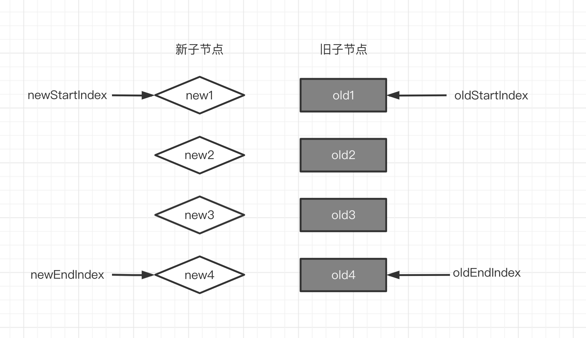

# 双端diff算法

双端diff比简单diff的优势在于，可以减少dom的移动，提高性能.  
双端diff与简单diff的区别就在于，双端diff是有四个索引值，即新节点数组的端点。可以进行两端节点的比较，更快的找到需要移动的dom,以最少的次数移动dom。

示意图:


通过这种方式可以拿到索引和对应的VNode
```javascript
 // 旧子节点数组第一项索引
let oldStartIdx = 0
// 旧子节点数组最后一项索引
let oldEndIdx = oldChildren.length - 1
// 新子节点数组第一项索引
let newStartIdx = 0
// 新子节点数组最后一项索引
let newEndIdx = newChildren.length - 1
// 旧子节点数组第一项VNode
let oldStartVNode = oldChildren[oldStartIdx]
// 旧子节点数组最后一项VNode
let oldEndVNode = oldChildren[oldEndIdx]
// 新子节点数组第一项VNode
let newStartVNode = newChildren[newStartIdx]
// 新子节点数组最后一项VNode
let newEndVNode = newChildren[newEndIdx]
```

双端diff算法处理过程分为以下几步:
1. old1节点与new1节点比较，如果key不同，则不复用。
2. old4节点与new4节点比较，如果key不同，则不复用。
3. old1节点与new4节点比较，如果key不同，则不复用。
4. old4节点与new1节点比较，如果key不同，则不复用。
   1. 以上四步没有命中则需要进行：
      1. new1节点在旧子节点列表中查找，获取对应的索引值oldIndex。如果oldIndex > 0则将oldIndex位置的dom移动到old1位置的前面去，oldIndex位置的设置为undefined
      2. oldIndex < 0 则表示new1是需要新增的节点,
      3. 当所有新子节点循环处理完，在去处理旧子节点中需要被卸载的节点。
        

具体实现可以看: src/diff双端diff.html
代码中有非常详细的注释
